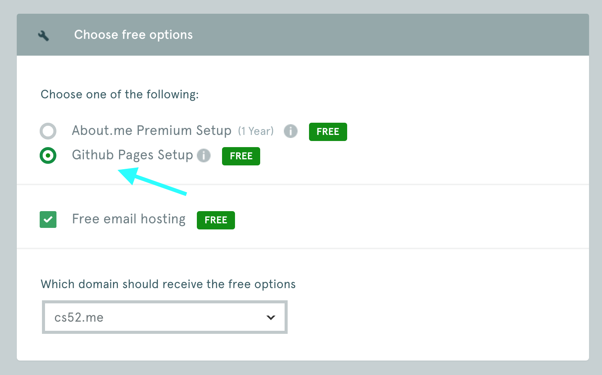
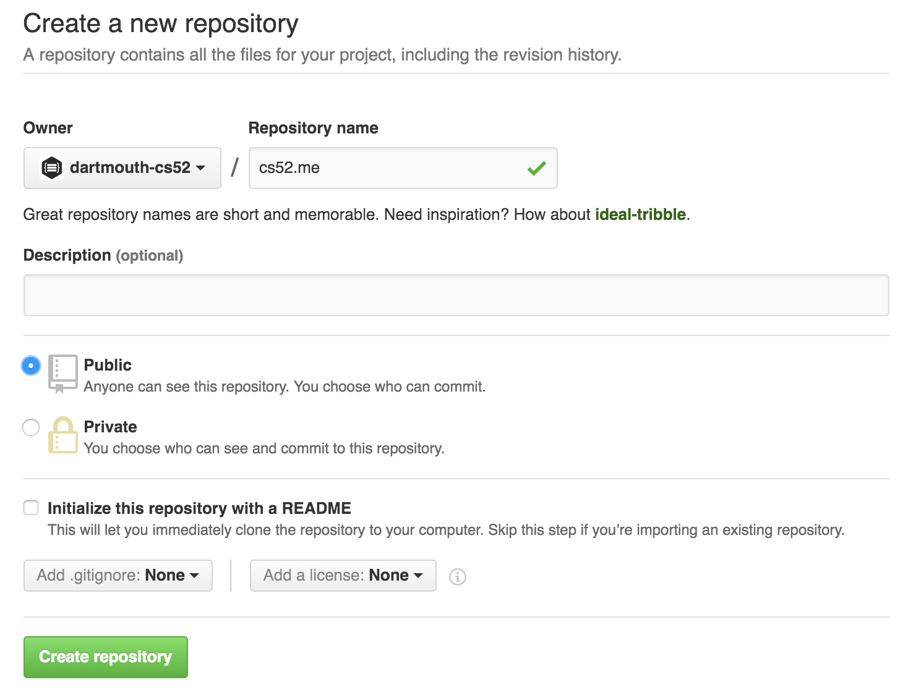
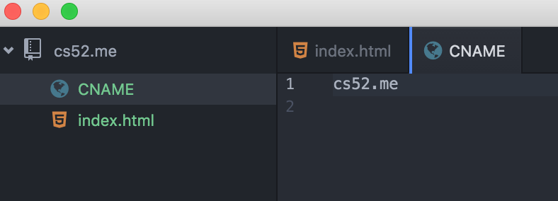
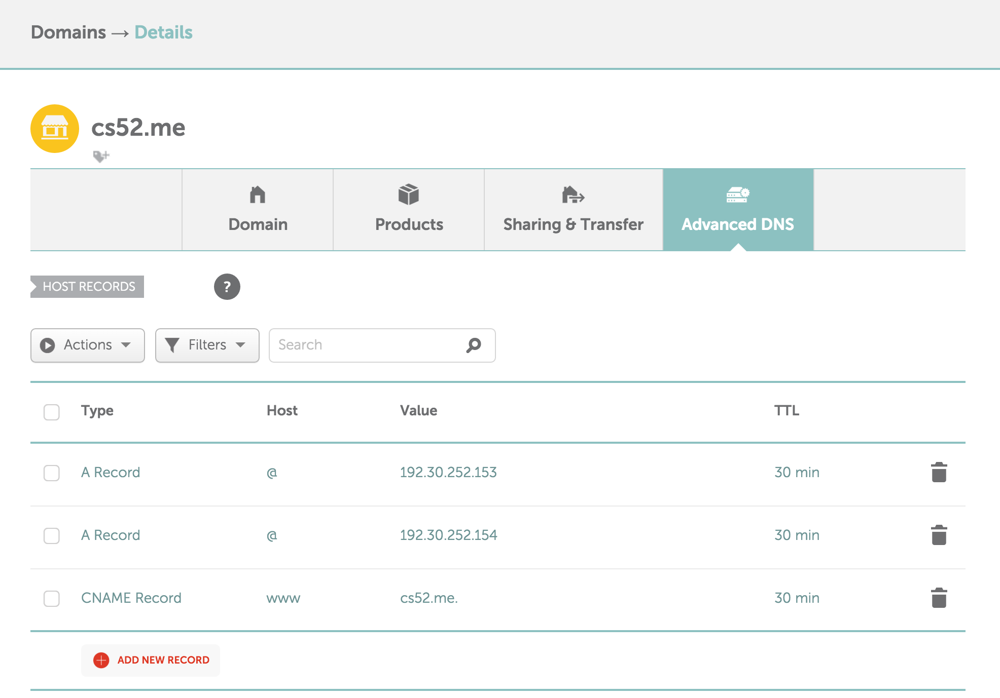
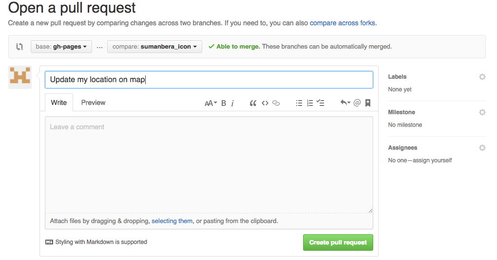
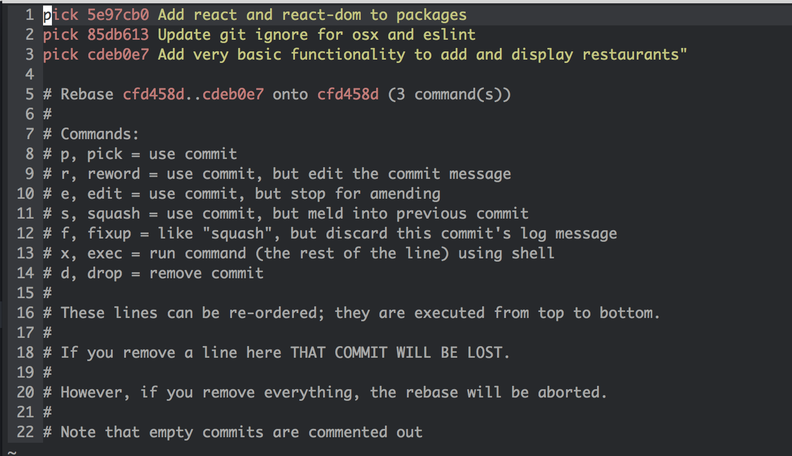

# DALI Collaborative Coding and Design Developer Details

We're going to be making a website from domain name to design and html/css. Then we will add an pin and image onto a shared map with a link to your new website.

(some screenshot examples are from cs52)

Key: <br />
🚀 steps to definitely pay attention to <br/>
💻 run this in Terminal<br />
🍸 pro tip<br />


## Steps At a Glance
Here's what we're going to do!

### Part 1: Domain Setup

1. Setup Local Dev environment
1. Download some tools
1. Register a domain
1. Create and clone a github repo
1. Create a webpage
1. Set up hosting and DNS


### Part 2: Edit DALI 17W Map

1. Clone The Repo
1. Start Local Webserver
1. Create a new branch
1. Merge Conflicts
1. Add some JS to Map
1. Rebase to pull new changes
1. Push branch to github
1. Create pull request


# Part 1:  Domain Setup

## Local Dev Environment

First things first.  You need a local development environment.  

*Why is this important you ask.  Couldn't I just copy code over to a server every time I make changes?  You could.  But imagine debugging,  every change you make you spend a few seconds maybe copying code over, or pushing git.  This time adds up.  Save yourself hours of your life, get your laptop set up for coding now.*


## DALI Tools! ##


🚀 Install [atom](http://atom.io).  Atom is a code editor.  Atom is an open source, made by Github
web technology written in html+css+javascript using a platform called [Electron](http://electron.atom.io/).  We'll be using Atom for coding and utilizing a lot of its plugins. After installing and starting up Atom, run: *Atom -> Install Shell Commands* to be able to run `atom` from the commandline.

🚀 If you don't have it, install [Google Chrome](https://www.google.com/chrome/browser/desktop/).  Why?
Because we'll be using [Chrome Developer Tools](https://developers.google.com/web/tools/chrome-devtools/) for debugging.

🚀 Install [GitHub Desktop](http://desktop.github.com).  We will be mostly using `git` from the commandline but installing the App gives you a nice tree visualization.


### OS X ###

🚀 Install [Homebrew](http://brew.sh/).  This is a package manager for all things open source.
We will use `brew` extensively to setup your dev environment.  If you run `brew doctor`  it should be mostly error free.

### Various Linux ###

Most of the directions through the class will be very similar on the various flavors of linux.  Mostly just replace any `brew` command with the package manager for your system (apt on Ubuntu or yum on Fedora).

### Windows ###

Windows is a trickier dev environment.  We'll try to provide directions but these may need revision.

In general though whenever we refer to 💻 Terminal you can just use ***Git Shell*** (which comes bundled with the GitHub app).  You may want to check out [Chocolatey](http://chocolatey.org) which is a package manager for Windows.

If you want to be brave you can try out the very new beta of [ubuntu in windows](https://blogs.msdn.microsoft.com/commandline/2016/04/06/bash-on-ubuntu-on-windows-download-now-3/) — no guarantees there.


## Command Line ##

We'll be doing a lot of commandline stuff.  We'll introduce stuff as we go, so do not fear, commandline is best.

If you are interested here's a tutorial that gives you more than enough to be a master:
[learn just enough commandline to be dangerous](https://www.learnenough.com/command-line-tutorial)

Here's some basics:

* `ls -la`  will list files in current directory
* `pwd`  will show current directory
* `cd  somedirectory`  will change directory to *somedirectory*
* `cp source target` will copy files
* `mv source target` will move
* `rm somefile` will remove that file (permanently, bypassing trash)
* `mkdir somedirectory` will create a folder (directory)

On OSX:

* `open somefile` will open the file in the default app associated with it
* `open somedirectory` will open that folder in Finder


## Register a Domain!

Lets start off the term right, with a domain of your own that you'll use throughout the course.

We'll use NameCheap as our registrar.  Namecheap is a good [net citizen](https://www.netneutrality.com/) and have free domains for students.

🚀 go to: [https://nc.me/](https://nc.me/)
and lets register you a domain!


🚀 I'm going to grab one for cs52 now too!


🚀 When prompted choose Github Pages Setup


🚀 Great, now we'll do the rest of the setup manually so when prompted to setup github — instead to do advance setup.


## Create a GitHub Repo

🚀 go to http://github.com  if you don't have an account, set one up! Use your .edu account and get the [GitHub Student Developer Pack](https://education.github.com/pack)

🚀 create a new repo for your domain, probably best to name it with your domain name.



🚀 Grab the URL for the repository (either SSH or HTML depending on how you have git setup.  If SSH gives you trouble just try HTML.)

**Note:**  the following are transcripts of a terminal session while setting up **cs52.me**.  You should replace anything with `cs52.me` with your own repo name and your github URL instead.


### Git global configs:
🚀 Setup your global config variables in *Terminal* if you haven't yet:

  💻`git config --global user.name "Jane Doe"`

  💻`git config --global user.email janedoe@example.com`

Ensure that the configs are set up with `cat ~/.gitconfig`. *Email* and *Name* should be filled out.

This is important, if you don't do this github won't really know who you are and you won't get credited for your commits!


### Clone the Repository
**What this does:** The repository is what git uses to store your project's information. It contains commits and references to commits (more on this later). The folder on your computer becomes your *workspace*.

From the command line (where you will run all future commands):

1. 🚀 Navigate to where you want the repo to end up on your computer. For example:
```bash
💻 mkdir ~/Documents/DALI
💻 cd ~/Documents/DALI
```
1. 🚀 Clone the repo:
```bash
💻 git clone YOUR_REPO_URL
```
1. 🚀 change directory to this new workspace:
```bash
💻 cd YOUR_REPO_NAME
```


### Create some HTML

```bash
💻 atom index.html
```
🚀 basically just start Atom and create a file called `index.html` in your cloned workspace.


### Test Locally

```bash
💻 python -m SimpleHTTPServer 9000
Serving HTTP on 0.0.0.0 port 9000 ...
127.0.0.1 - - [09/Jun/2016 18:25:18] "GET / HTTP/1.1" 200 -
```
*If you are running python3 try: `python -m http.server 9000` instead.*

❓does anybody know what `127.0.0.1` is the address for?

🚀 Lets check out what we have made in Chrome: http://localhost:9000


Note: to quit the python server type: ctrl+c
(this is a default for many commandline processes).


### Now Add Some Content

* A picture of yourself
* Your name
* Where you’re from/where you live
* A short bio telling us about yourself (you might include/mention: design/programming applications you know, what you enjoy most about ui/ux design/development, why you’re excited to work with DALI.)
* Something interesting about yourself :-)

Go here to learn some HTML/CSS: http://learn.shayhowe.com/html-css/

🎆 Have fun with this part - experiment. To see your changes just refresh the page in your browser.

### Images
To insert a new image just put a .jpg or .png in an `images` folder and use the syntax in your html.

```

```

More here: http://learn.shayhowe.com/html-css/adding-media/#adding-images

🚀 At this point you should have some html and a page showing up in your browser. Make sure it works and all images load etc.

### An Overview of Git
Now that you've made some changes to the site, we'll go over how to use git to add, commit, and push your changes. Git is a code version control system and allows you to have a named log of your changes to the code and a way to work on the same files together with other people. It is sort of like an offline google docs where you *commit* (explicitly name) every set of changes. [Here's a good resource](http://rogerdudler.github.io/git-guide/) but we'll do the basics here.


This is a good overview image for the things you'll be doing — it'll all make sense eventually.


#### Git Add

**What this does:** The add step tells git which files from the workspace you want it to track, or add to the index.

  - 🚀 **Check your status:** Use `git status` to see what git thinks you have been working on. If you see *untracked* that means git doesn't know that you want to commit those file.
  - 🚀 **Add Untracked Files:** Use `git add filename` on those files to tell git to track them.
    - You might also used `git add .` to add all untracked files recursively from the current directory.
  - 🚀 Go ahead a try to add your new files now. Run `git status` to make sure they are added.


```bash
💻 git status  #check and see what the story is
On branch master

Initial commit

Untracked files:
  (use "git add <file>..." to include in what will be committed)

  index.html

nothing added to commit but untracked files present (use "git add" to track)
💻 git add index.html  #lets track index.html
💻 git status  #check again -- I'm OCD with this
On branch master

Initial commit

Changes to be committed:
  (use "git rm --cached <file>..." to unstage)

  new file:   index.html

```

#### Git Commit
**What this does:** Committing files tells git that you want to name and save the changes you have made as a concrete *changeset*. For now this changeset is only saved locally in your local repository. Commits should represent one logical change in the repo and the commit message should make that change clear.

  - 🚀 **Commit your changes:** ```git commit -am "i made some changes"```
    - ``-a`` means all changes
    - ``-m`` indicates that your commit message follows directly, a commit message is required.
  - Example of sample commit chains that adds new payments feature to an e-commerce website:
    - "Setup and initialize new Charge Table"
    - "Add API call to generate a new Charge"
    - "Add task that processes new charges"
    - "Add tests to make sure charge amounts are accurate between server and client"

```
💻 git commit -am "its hideous"   #please make yours prettier 😃
[master (root-commit) 93a5c69] its hideous
 1 file changed, 10 insertions(+)
 create mode 100644 index.html
```

#### Git Branch

Ok, now we have a local commit!  However before we push our changes.. GitHub Pages requires that the git branch we use for their hosting is named `gh-pages`.

So lets rename our branch!

```bash
💻 git branch
 * master
💻 git branch -m master gh-pages
💻 git branch
 * gh-pages
```

#### Git Push

```bash
💻 git push -u origin gh-pages
Counting objects: 3, done.
Delta compression using up to 8 threads.
Compressing objects: 100% (2/2), done.
Writing objects: 100% (3/3), 289 bytes | 0 bytes/s, done.
Total 3 (delta 0), reused 0 (delta 0)
To git@github.com:dartmouth-cs52/cs52.me.git
 * [new branch]      gh-pages -> gh-pages
```

### Default GitHub Pages Hosting

By default GitHub Pages, when it sees a branch named `gh-pages`, will publish it at `http://<github username>.github.io/<repository name>`.

🚀 You can make sure of this by going to Settings for your repository.


### CNAME hosting

But we want our domain!

Ok. Add another file to your local workspace named `CNAME`.  Inside this file put in just one line with your domain name.



🚀 Now you have to `git add` and `git commit` and `git push` this new file.  See [Git Add](#git-add) section (skip branching as thats a one time thing).

### DONE with Part 1!

As soon as you `git push` your site should become available at your URL!  *Note: actually it might take up to 5 minutes for it to start working with your domain name as github pushes your content to various servers.*


### What About DNS?!?!

You didn't actually have to do any DNS setup,  what happened?

NameCheap set up all the right Domain Name Service Records automatically for you. In NameCheap you can inspect what it did:



Take a look at your settings in your Namecheap Dashboard.

Note the 2 IP addresses in the `A Record` fields,  those are github servers.

🚀 Try doing a reverse DNS lookup (IP address to name):

```bash
💻 host 192.30.252.153
153.252.30.192.in-addr.arpa domain name pointer pages.github.com.
```

Wait,  but how does pages.github.com know? Does that machine serve lots of addresses?

Yes, those IPs point to load balancers that direct requests based on the transport packet which happens to have the domain name requested in it.  This is where that magical `CNAME` file comes in.  That tells GitHub Pages that your repository should be served when requests come in for that domain. :cool:


# Part 2: Edit DALI 17W Map

Now that you have a personal page up.  Let's add you to the DALI 17W Map!


### Clone The Repo

1. 🚀 Clone the repo:
`git clone https://github.com/dali-lab/17W-mappy.git`
1. 🚀 change directory to this new workspace:
`cd 17W-mappy`


### Start Local Webserver

```bash
💻 python -m SimpleHTTPServer 9000
Serving HTTP on 0.0.0.0 port 9000 ...
127.0.0.1 - - [09/Jun/2016 18:25:18] "GET / HTTP/1.1" 200 -
```
Lets check out what we have made in Chrome: http://localhost:9000


### Proper Git Flow

We're doing something a little different with git this time.  You are modifying a file that other people might be working on, thus the potential for a merge conflict arises.   The default flow for collaborating with others is:

1. `git commit` your local work
1. `git pull` to get any upstream commits (commits that exist on github but not on your computer yet)
1. resolve any conflicts that might have arisen
1. `git add` conflicted file to mark them as resolved
1. `git commit` your changes
1. `git push` your changes up to github

However!  We will be doing a slightly modified flow using feature branches.

It will go something like this:

1. `git branch` to create a new branch of code to work in
1. `git commit` your local work
1. `git pull --rebase` to merge any upstream main branch commits onto your branch
1. resolve any conflicts that might have arisen
1. `git add` conflicted files to mark them as resolved
1. `git commit` your changes
1. `git push` your branch up to github
1. create a pull request on github
1. get your pull request from your feature branch merged into the main branch


Here we go through a more in depth git flow that includes code branches and pull requests.  In general if your team is larger than 2 people you should definitely use this!

We're going to create a branch now and try out this new workflow.

### Create a new branch
Start a local feature branch and do work on it. A branch keeps your work separate from the main (usually called *master*) branch.  Think of this as a tree where the *master* (or in our case *gh-pages*) branch can be thought of as the trunk.

Here is a great visualization tool to help see what you are doing in the git tree: [git-with-d3](https://onlywei.github.io/explain-git-with-d3/#branch)

```bash
💻 git branch <feature>  # creates new branch feature
💻 git checkout <feature>  # switches to branch feature
```

🍸 Protip: `git checkout -b` will both create a new branch and check it out to make it the current branch you are working on.

🍸 Protip: `git branch` will show which branches exist and which you're on (the `*`).


🚀 lets name our branch feature with yourname_icon! `git checkout -b yourname_icon`.   (lowercase and no spaces)

🚀 if you do `git branch` you should see `* yourname_icon`.


🍸 Protip: Periodically pull in changes from *origin/gh-pages* (or *origin/master* in other situations) and update your feature branch.
Note that these commands only update your current local branch.  The idea here is to not fall too far behind the master branch if other people are working on it.

```bash
💻 git pull origin gh-pages
```

#### Merge Conflicts

At this point after a `git pull` you **may** get a message that looks like this:

```
CONFLICT (content): Merge conflict in somefile
Automatic merge failed; fix conflicts and then commit the result.
```

This is when the fun starts.  How do you fix this?

The cause for merge conflicts is that you edited the exact same line/s as someone else and git doesn't know how to automatically resolve that.  This happens and is normal, don't worry.  So to fix you just need to pick apart the conflict and merge it in — continue to the next section to see how this happens!

#### Deciphering Merge Conflicts

If you were to do this by hand, git takes the pretty code you wrote and injects terrible "conflict markers" that look like this:

```
<<<<<<< HEAD
var h = 'hello, world';
=======
var h = 'Hi!';
>>>>>>> cb1abc6bd98cfc84317f8aa95a7662815417802d
```

where the line between  `<<<HEAD` and `====` is the line/lines of code that are relevant in your file, and between  `====` and `>>>> cb1abc6` are from the remote repository (the repository that you see on github.com). The crazy characters refer to the commit that the change comes from.

Since we've been using Atom so far there is a nice plugin to help visualize this a little better. *Atom -> Preferences -> Install -> search* for merge-conflicts


Once you have your conflict file the way you want it — ie. fixed and without any more of the conflict markers...

- All you have to do to continue is:  `git add thefixedfile` which indicates to git that you have resolved the conflict. Then `git commit` with no options will complete the merge and automatically create a commit message.


### Map and Javascript

Now lets add a picture of yourself and a lat long for a place that you like or are from.

🚀 Open `main.js` in atom.

🚀 Find where we run the method `addMarker` to create a marker for Froggy.
Copy that function call and paste it in somewhere in the `SECTION FOR MARKERS`.  

Add an image of yourself into `images`.   It would probably be a good idea to resize your image to be 200x200 pixels. If you don't have a favorite tool for this try [resizeimage](http://resizeimage.net/)

For the `url` field use the new page that you made earlier!  Rather than using http:// or https:// just start the url with //.  The browser will then match the protocol (http or https) to how the page was loaded and thus avoid errors about insecure resources.

Find a lat long: http://www.latlong.net/

🚀 Play around with it till you have a working badge visible on your local dev site:  http://localhost:9000/ and when click on the badge it is able to load in the page you made into the modal.


### Rebase local branch
When you're nearly ready to publish, rebase your local branch on top of the latest master one more time. Just like you have been above. Note: we are using rebasing here instead of just pulling, because now we are pros. 🏆  What this does is basically pull in all remote changes and then replay your commits on top of them. This gives you a cleaner version history.

```bash
💻 git pull --rebase origin gh-pages
```

If you have rebase conflicts, fix the files as in [Deciphering-Merge-Conflicts](#Deciphering-Merge-Conflicts) and do `git add`, then
 `git rebase --continue`. Repeat until you're all good.


### Push Your Feature Branch

After you are finished working on your branch, you should push it up to github.

```bash
💻 git push origin yourname_icon
```
🍸 Protip: git does not push multiple branches by default, but you can with: `git push --all origin`.  Just be careful if you have a ton of test branches lying around.


### Create Pull Request

The best way to merge your feature into the main branch is to issue a pull request. This bundles up your feature branch into a request that you or someone else on your team can approve.

🚀 Go to Github (or use the Github Desktop App) and submit a *New Pull Request* (choosing whatever branch you just pushed), add a quick description. Possibly do code review or just approve the request yourself. The idea here is that this is a checkpoint spot before adding your feature to the main branch so that everybody on your teams knows what is happening.



Ensure that you are comparing the correct two branches. Set "base" branch to be the branch where you want to commit your changes and "compare" branch to be the branch where your commits reside (see above image).

To do a code review, @mention a peer in the pull request. Once approved, your code changes will be merged. You can also merge pull requests after carefully reviewing all the changes.


Alternatively you can merge your changes in to the master branch without a pull request, but this should only be done if you are using git on your own or with a very small team!

```bash
git checkout master
git merge your_feature_branch_name
```

**Once you no longer need a branch you should delete it!**
You can do this on github.


You can also do this locally with `git branch -d your_feature_branch_name`.
Note: you have to delete it in both places, as just deleting it remotely won't delete it locally.


## DONE!!

Once your changes are merged into the remote `gh-pages` branch on github you'll be able to see your changes at: https://dali-lab.github.io/17W-mappy

<br>
<hr>
<br>

## Additional Git Tips and Resources:

[Git CheatSheet](http://www.ndpsoftware.com/git-cheatsheet.html#loc=workspace)

#### Sample Git Config
To edit `atom ~/.gitconfig`

```bash
[user]
    name = John Doe
    email = johndoe@dali.dartmouth.edu
[alias]
    pullorigin="pull --rebase origin"   # tweak naming to whatever, but a nice shortcut to ensure --rebase
    co="checkout"
    st="status"
    br="branch"
[branch]
    autosetuprebase = always    # set rebase to be default for new branches
[push]
    default = simple
```

Setting up `git push` to use `simple` matching is very important. Otherwise it
is easy, while you're force-pushing a feature branch, to also accidentally force
push your master to the prod repo. See [here](http://stackoverflow.com/a/13148313)
for a good explanation.

### Optional Cleaning up of local branch history
You might want to consider cleaning up your local branch history. It's a good
idea to commit frequently as checkpoints to save your work, but if you have a
lot of them, the shared repo history will look cleaner without them.

A nice way to visualize your commits and branches locally is `git log --graph --oneline`. Alternatively, use a GUI like GitX (http://rowanj.github.io/gitx/).

Then, rebase with up git "interactive" mode, which will pull up your text editor.
```bash
git rebase -i master
```
OR
```bash
git rebase -i HEAD~X
```
where X is the number of commits back you want to roll back, OR
```bash
git rebase -i xxxxxx
```
where xxxxxx is the commit id, which you can get from `git log`.

To squash a commit into the previous one, replace "pick" with "s" or "squash" and save the file.



This is the screen you will see after typing `git rebase -i`.
This file will be launched in your default text editor.
You have many different options, typically `squash` is the most useful.


By changing the character in front of the second commit to `s`,
we are "combining" the second commit into the first commit.
To finish, save and exit on your text editor (:wq in Vim).


After squashing, you have to write a new commit message.
Again to finish, save and exit on your text editor. Done!

**Note:** this can cause problems if you've pushed your branch to your remote repo, since you are rewriting commit history in your local branch and this will mismatch with the remote repo's history. Best to do this before pushing, but if you've done a rebase commit squash on commits that you already pushed, then the next time you push to the remote repo you will have to do a forced update `git push -f origin feature`. However be aware that this is dangerous and anyone else working on this feature branch will have issues pushing their branch. One solution to this is asking them to `stash` their commits and then `rebase` after you push your branch. You've been warned.


#### Useful Commands

##### Push local branch to your remote repo

```bash
git push -u origin <feature>
```
`-u` is short for `--set-upstream`, which will set up your local branch to pull automatically from this newly pushed branch. However it's optional.

##### Delete remote branch
```bash
git push origin --delete <feature>
```

##### Delete local branch
```bash
git branch -D <feature>
```

##### Checkout a remote branch
```bash
git checkout <feature>     # shorter version, works with newer versions of Git
```

##### Reset your branch to some other branch

Be careful about this!! You will lose your local changes.
```bash
git reset --hard mybranch goodbranch
git reset --hard master origin/master   
```

##### Grab a commit from another branch
Sometimes you commit to the wrong branch. Figure out the commit ID of the commit
you want to grab.
```bash
git cherry-pick <COMMIT ID>
```

#### Basic guidelines
- Try to use `git rebase` commands when possible rather than `git merge`, so we
can have a cleaner and more linear Git commit history (that said, merge commits do have their place).
- Use local branches to do most of your more involved work (this also lets you
  quickly switch between different features, or pause work on a feature to work on a bug fix).
- The general idea is to try to resolve conflicts locally (by pulling in changes
  from the shared repo before pushing), so merging into master (either manually
    or by Github pull request merge should be simple and automatic)

#### Some more Pro-tips
- If you are doing a complex rebase merge fix, if you squash your commits first
(see earlier notes about rebase interactive), you can do your manual merge fixes
in fewer, as there are fewer commits to have to edit. Otherwise you may be opening
your text editor a lot.


#### Git Bash Scripts
- Add the following to your `.bash_profile` to see your current branch and status
within the command line prompt:


```bash
# Prompt to add branch and status to the command line
COLOR_RED="\[\e[31;40m\]"
COLOR_GREEN="\[\e[32;40m\]"
COLOR_CYAN="\[\e[36;40m\]"
COLOR_RESET="\[\e[0m\]"

function git_branch_name {
  ref=$(git symbolic-ref HEAD 2> /dev/null) || return
  echo " ("${ref#refs/heads/}")"
}

function git_branch_color {
  if [[ $(git status 2> /dev/null | grep -c :) == 0 ]]
    then echo "${COLOR_GREEN}"
    else echo "${COLOR_RED}"
  fi
}

function prompt_title {
  PS1="\w$(git_branch_color)$(git_branch_name)${COLOR_RESET} \$ "
}

PROMPT_COMMAND=prompt_title
```

#### Git Autocompletion
This will allow you to do `git checkout TAB` for a list of branches. First, download the git autocompletion support for bash.

```bash
curl https://raw.githubusercontent.com/git/git/master/contrib/completion/git-completion.bash -o ~/.git-completion.bash
```

Then, add the following to your `~/.bash_profile`.

```bash
if [ -f ~/.git-completion.bash ]; then
  . ~/.git-completion.bash
fi
```
More information can be found [here](http://apple.stackexchange.com/questions/55875/git-auto-complete-for-branches-at-the-command-line)
